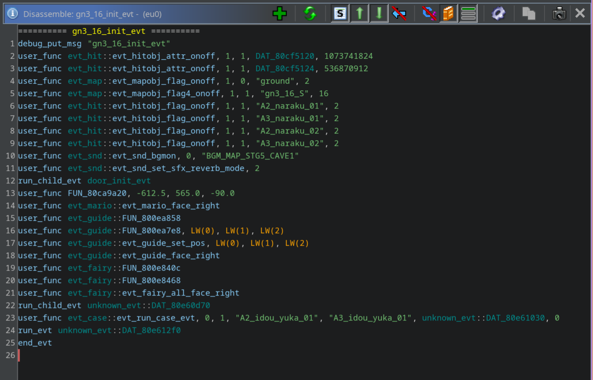
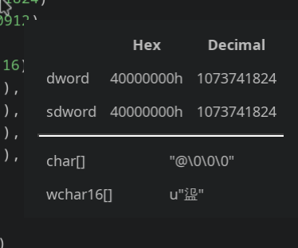
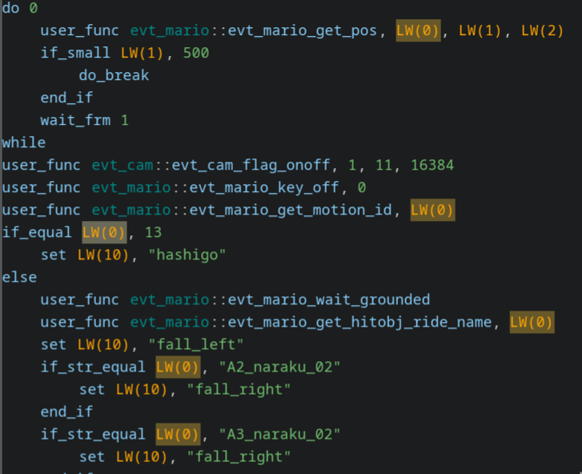
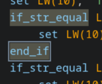
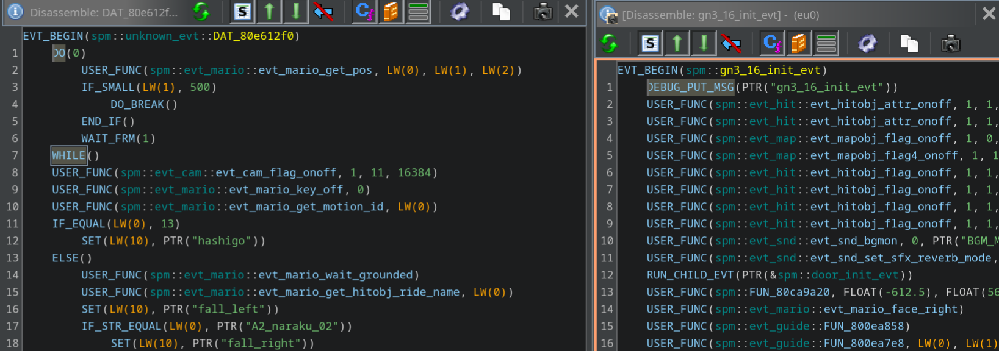
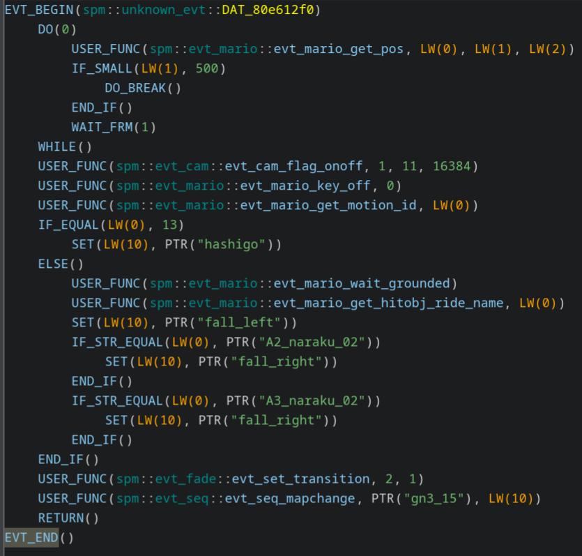

# GhidraEvt

A Ghidra extension for integrated disassembly of the evt script format used by Paper Mario: The Thousand Year Door and Super Paper Mario.   

## Features

The extension adds a window that renders the script disassembly of the current location in the program:

This window supports many features seen in the main decompiler window, such as:
- CTRL+F, CTRL+A, CTRL+C, CTRL+V
- Renaming, retyping and finding references to symbols
- Rendering of string constants
- Seeing constants in other forms by hovering over them

    
- Middle clicking a token to highlight all other matching tokens

    
- Highlighting of matching bracket-like instructions

    
- Cloning the window to keep another script open

    

There is also an option to display the scripts in the C macro format for use in decomp/mods:

The window is also fully customisable using Ghidra's built-in theming system (see `data/ghidraevt.theme.properties` for the names of the relevant theme components). Note that some parts are derived from the decompiler's theme, such as symbol colours. I'm no artist so, I'm open to changing the default theme if anyone has suggestions (in particular, light mode probably looks quite bad right now).

## Installing

1. Acquire a build of the extension from https://github.com/SeekyCt/GhidraEvt/releases
2. Navigate to your Ghidra installation directory and place the zip in `Extensions/Ghidra/`
    - Do not unzip this file
3. In the main Ghidra window, open `File > Install Extensions` and tick `GhidraEvt`
4. Restart Ghidra
5. Open a project, and you should be prompted to configure plugins
    - If not, the same GUI can be opened through `File > Configure > GhidraEvt`
6. Tick the `GhidraEvt` plugin
7. You should now be able to open the script disassembly view through `Window > Evt Disassembler`
    - Selecting a data address in the listing view will automatically attempt to disassemble it and update the window
    - Options have not yet been implemented, though theming is supported through Ghidra's existing theme system

## Credits

- This extension is created from [Ghidra](https://github.com/NationalSecurityAgency/ghidra/)'s Extension Skeleton and is heavily based on its Decompiler UI code.
- Thanks to [PistonMiner](https://github.com/PistonMiner/) for their [original documentation of the evt script format](https://github.com/PistonMiner/ttyd-tools)
